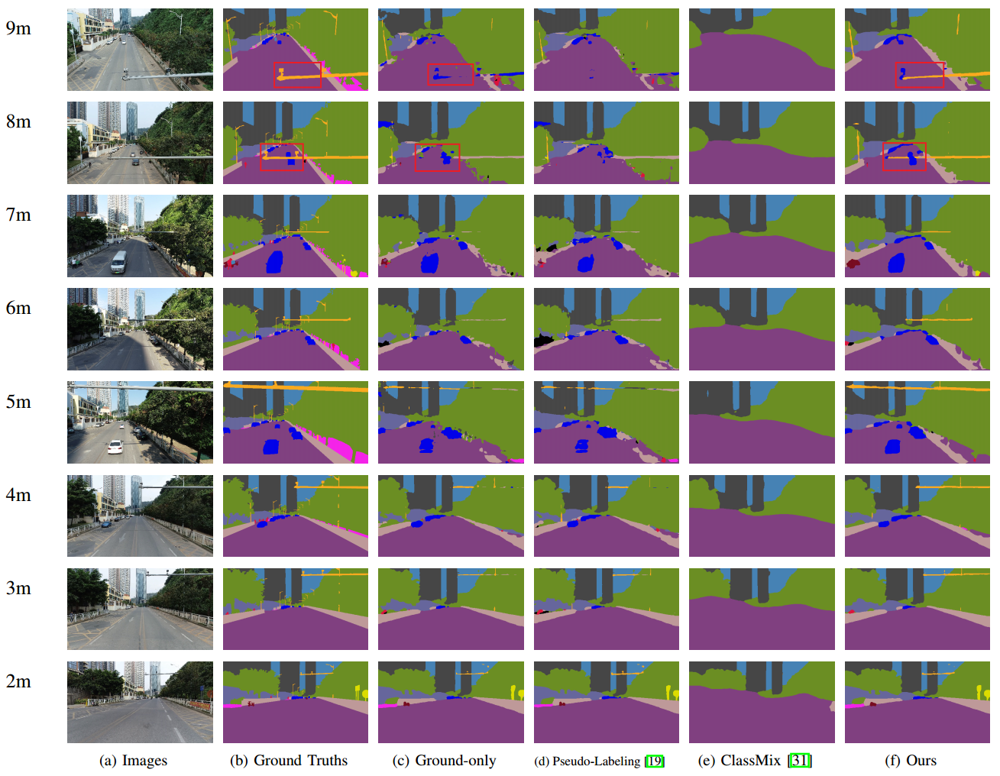

# Progressive Self-Distillation for Ground-to-Aerial Perception Knowledge Transfer

We introduce the ground-to-aerial (GoA) distillation that transfers the perception knowledge from a UGV for ground viewpoint perception to drone perception tasks. This repo provides a novel semi-supervised learning framework that solves GoA perception knowledge distillation with labeled images from the ground viewpoint as well as unlabeled images from flight viewpoints. For more detailed information, please check our [paper](https://arxiv.org/pdf/2208.13404.pdf).

Results
-
Qualitative comparisons on the simulated data.

 

Qualitative comparisons on the real-world data.

 

Dependencies
-
+ python 3.6.5 
+ torch 1.5.1 
+ torchvision 0.6.1 
+ tqdm 4.49.0 
+ matplotlib 3.3.2 
+ numpy 1.19.2 
+ pillow 8.4.0 
+ opencv-contrib-python 3.4.1.15 

Datasets
-
We create two datasets for evaluation.

 

Structure of the datasets:

	airs
		uav0X (X denotes flying height)
			images: directory storing images 
			semantic: directory storing ground truth semantic maps
			semantic_pl: directory storing pseudo-labeled semantic maps during training

		pl_csv
	     		airs.csv: a csv file storing the path of images and corresponding pseudo-labeled semantic maps during training

		uav0X.csv (X denotes flying height): a csv file storing the path of images
		uav01_labeled.csv: a csv file storing the path of images and semantic maps of ground viewpoint
		uav0X_test_gt: a csv file storing the path of images and semantic maps of 2-9 meters for testing

	airsim
		car00: directory storing images and semantic maps of ground viewpoint

		uav0X (X denotes flying height)
			images: directory storing images 
			semantic: directory storing ground truth semantic maps
			semantic_pl: directory storing pseudo-labeled semantic maps during training

		pl_csv
			airsim.csv: a csv file storing the path of images and corresponding pseudo-labeled semantic maps during training
		test
			directory storing images and semantic maps of the test set			

		car00.csv: a csv file storing the path of images and semantic maps of ground viewpoint
		uav0X.csv (X denotes flying height): a csv file storing the path of images and semantic maps
		test.csv: a csv file storing the path of images and semantic maps of the test set

Running
-
The network of drone semantic segmentation is built on [DeepLabv3+](https://github.com/VainF/DeepLabV3Plus-Pytorch).   
Download the [datasets](https://drive.google.com/file/d/1QIAxREWd-Wr4pGsSDEpiJTIplNIu7Mcn/view?usp=sharing), unzip them to ./datasets/ 
Download our trained [models](https://drive.google.com/file/d/10p96MeiScVnut9h889rusCQbiFNu7SdW/view?usp=sharing), unzip them to ./runs/
  

+ ### Test 
	 Testing on the AirSim-Drone: python test_airsim.py 
	 Testing on the AIRS-Street: python test_airs.py 
+ ### Train 
	 Training on the AirSim-Drone: python train_airsim.py 
	 Training on the AIRS-Street: python train_airs.py 

Citation
-

    @article{hu2022progressive,
      title={Progressive Self-Distillation for Ground-to-Aerial Perception Knowledge Transfer},
      author={Hu, Junjie and Fan, Chenyou and Ozay, Mete and Feng, Hua and Gao, Yuan and Lam, Tin Lun},
      journal={arXiv preprint arXiv:2208.13404},
      year={2022}
    }
    
    

